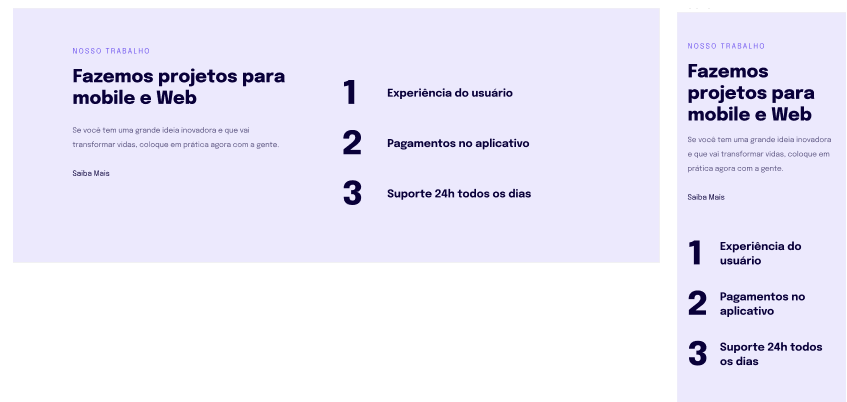

# Projeto04 do curso Explorer da Rocketseat

    
    
    

Este projeto é uma introdução à responsividade, demonstrando como criar layouts responsivos para diferentes dispositivos, incluindo mobile e web.

## :exclamation: Pré-requisitos

Navegador web moderno

## :hammer: Intalação

1. Clone o repositório: git clone https://github.com/Raissa-Cardoso/XR-Projeto04.git
2. Abra o arquivo `index.html` em seu navegador web.

## :computer: Uso

Após abrir o arquivo `index.html` em seu navegador, você verá uma página de introdução à responsividade, com informações sobre projetos para mobile e web e benefícios oferecidos.

## :star: Tecnologias utilizadas

- **`HTML`**
- **`CSS`**
